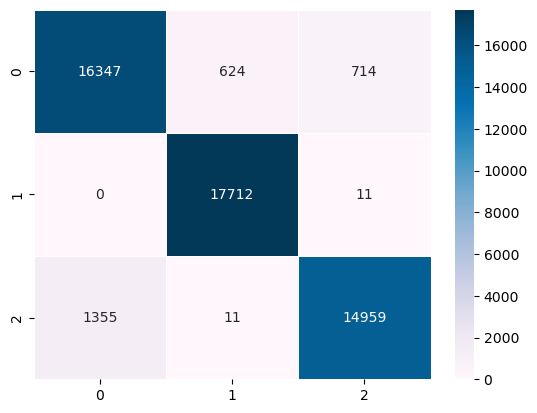
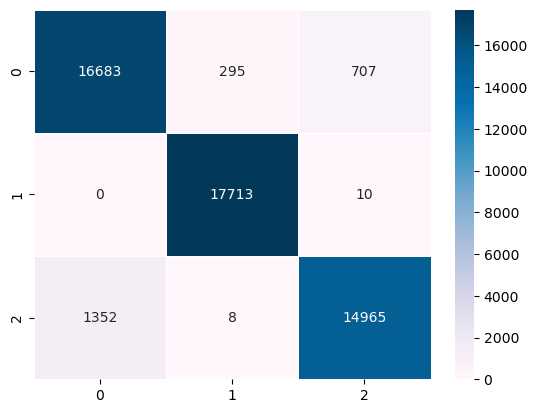
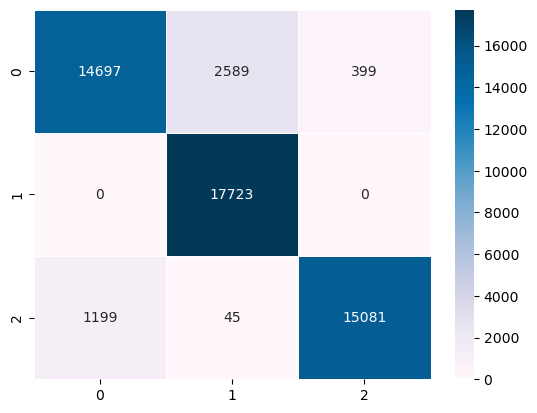

### Initial Model Training

#### Logistic Regression - No Regularization

Classification Report: 

              precision    recall  f1-score   support

      GALAXY       0.92      0.92      0.92     17685
        STAR       0.97      1.00      0.98     17723
      QUASAR       0.95      0.92      0.93     16325

    accuracy                           0.95     51733
   macro avg       0.95      0.95      0.95     51733
weighted avg       0.95      0.95      0.95     51733

Balanced accuracy score: 

0.9466822187647795

#### Logistic Regression - L1 Regularization

Classification Report: 

              precision    recall  f1-score   support

      GALAXY       0.93      0.94      0.93     17685
        STAR       0.98      1.00      0.99     17723
      QUASAR       0.95      0.92      0.94     16325

    accuracy                           0.95     51733
   macro avg       0.95      0.95      0.95     51733
weighted avg       0.95      0.95      0.95     51733

Balanced accuracy score: 

0.9531565888100934

#### Logistic Regression - L2 Regularization

Classification Report: 

              precision    recall  f1-score   support

      GALAXY       0.92      0.92      0.92     17685
        STAR       0.97      1.00      0.98     17723
      QUASAR       0.95      0.92      0.93     16325

    accuracy                           0.95     51733
   macro avg       0.95      0.95      0.95     51733
weighted avg       0.95      0.95      0.95     51733

Balanced accuracy score: 

0.9466822187647795

#### SVM

Classification Report: 

              precision    recall  f1-score   support

      GALAXY       0.92      0.83      0.88     17685
        STAR       0.87      1.00      0.93     17723
      QUASAR       0.97      0.92      0.95     16325

    accuracy                           0.92     51733
   macro avg       0.92      0.92      0.92     51733
weighted avg       0.92      0.92      0.92     51733

Balanced accuracy score: 

0.9182803710154867

#### XG Boost

Classification Report: 

              precision    recall  f1-score   support

      GALAXY       0.96      0.97      0.97     17685
        STAR       1.00      1.00      1.00     17723
      QUASAR       0.97      0.96      0.96     16325

    accuracy                           0.98     51733
   macro avg       0.98      0.98      0.98     51733
weighted avg       0.98      0.98      0.98     51733

Balanced accuracy score: 

0.9757190225521732

#### Random Forest

Classification Report: 

              precision    recall  f1-score   support

      GALAXY       0.96      0.97      0.97     17685
        STAR       1.00      1.00      1.00     17723
      QUASAR       0.97      0.96      0.97     16325

    accuracy                           0.98     51733
   macro avg       0.98      0.98      0.98     51733
weighted avg       0.98      0.98      0.98     51733

Balanced accuracy score: 

0.9785542496094847

#### Neural Network

Classification Report: 

              precision    recall  f1-score   support

      GALAXY       0.93      0.94      0.93     17685
        STAR       0.99      1.00      0.99     17723
      QUASAR       0.95      0.92      0.93     16325

    accuracy                           0.96     51733
   macro avg       0.95      0.95      0.95     51733
weighted avg       0.95      0.96      0.95     51733

Balanced accuracy score: 

0.9542573102085742

