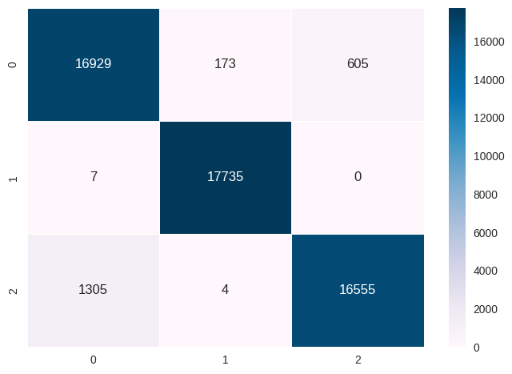

### Initial Model Training

#### Logistic Regression - No Regularization

Classification Report: 

              precision    recall  f1-score   support

      GALAXY       0.92      0.92      0.92     17685
        STAR       0.97      1.00      0.98     17723
      QUASAR       0.95      0.92      0.93     16325

    accuracy                           0.95     51733
   macro avg       0.95      0.95      0.95     51733
weighted avg       0.95      0.95      0.95     51733

Balanced accuracy score: 

0.9466822187647795

#### Logistic Regression - L1 Regularization

Classification Report: 

              precision    recall  f1-score   support

      GALAXY       0.93      0.94      0.93     17685
        STAR       0.98      1.00      0.99     17723
      QUASAR       0.95      0.92      0.94     16325

    accuracy                           0.95     51733
   macro avg       0.95      0.95      0.95     51733
weighted avg       0.95      0.95      0.95     51733

Balanced accuracy score: 

0.9531565888100934

#### Logistic Regression - L2 Regularization

Classification Report: 

              precision    recall  f1-score   support

      GALAXY       0.92      0.92      0.92     17685
        STAR       0.97      1.00      0.98     17723
      QUASAR       0.95      0.92      0.93     16325

    accuracy                           0.95     51733
   macro avg       0.95      0.95      0.95     51733
weighted avg       0.95      0.95      0.95     51733

Balanced accuracy score: 

0.9466822187647795

#### SVM

Classification Report: 

              precision    recall  f1-score   support

      GALAXY       0.92      0.83      0.88     17685
        STAR       0.87      1.00      0.93     17723
      QUASAR       0.97      0.92      0.95     16325

    accuracy                           0.92     51733
   macro avg       0.92      0.92      0.92     51733
weighted avg       0.92      0.92      0.92     51733

Balanced accuracy score: 

0.9182803710154867

#### XG Boost

Classification Report: 

              precision    recall  f1-score   support

      GALAXY       0.96      0.97      0.97     17685
        STAR       1.00      1.00      1.00     17723
      QUASAR       0.97      0.96      0.96     16325

    accuracy                           0.98     51733
   macro avg       0.98      0.98      0.98     51733
weighted avg       0.98      0.98      0.98     51733

Balanced accuracy score: 

0.9757190225521732

#### Random Forest

Classification Report: 

              precision    recall  f1-score   support

      GALAXY       0.96      0.97      0.97     17685
        STAR       1.00      1.00      1.00     17723
      QUASAR       0.97      0.96      0.97     16325

    accuracy                           0.98     51733
   macro avg       0.98      0.98      0.98     51733
weighted avg       0.98      0.98      0.98     51733

Balanced accuracy score: 

0.9785542496094847

#### Neural Network

Classification Report: 

              precision    recall  f1-score   support

      GALAXY       0.93      0.94      0.93     17685
        STAR       0.99      1.00      0.99     17723
      QUASAR       0.95      0.92      0.93     16325

    accuracy                           0.96     51733
   macro avg       0.95      0.95      0.95     51733
weighted avg       0.95      0.96      0.95     51733

Balanced accuracy score: 

0.9542573102085742

### Hyper parameter tunning

#### Logistic Regression without Regularization

Best hyperparameters:  {'C': 10000, 'max_iter': 200, 'solver': 'lbfgs'}
Best score:  0.9363318461352949
Classification Report: 

              precision    recall  f1-score   support

      GALAXY       0.89      0.92      0.90     17707
        STAR       0.99      1.00      1.00     17742
      QUASAR       0.93      0.88      0.91     17864

    accuracy                           0.94     53313
   macro avg       0.94      0.94      0.94     53313
weighted avg       0.94      0.94      0.94     53313

#### Logistic Regression with L1 Regularization

Best hyperparameters:  {'C': 100, 'max_iter': 5000, 'penalty': 'l1', 'solver': 'saga'}
Best score:  0.9360424454359098
Classification Report: 

      GALAXY       0.89      0.92      0.90     17707
        STAR       0.99      1.00      0.99     17742
      QUASAR       0.93      0.88      0.91     17864

    accuracy                           0.93     53313
   macro avg       0.94      0.93      0.93     53313
weighted avg       0.94      0.93      0.93     53313

#### Logistic Regression with L2 Regularization

Best hyperparameters:  {'C': 5000, 'max_iter': 500, 'penalty': 'l2', 'solver': 'lbfgs'}
Best score:  0.936307729410346
Classification Report: 

              precision    recall  f1-score   support

      GALAXY       0.89      0.92      0.90     17707
        STAR       0.99      1.00      1.00     17742
      QUASAR       0.93      0.88      0.91     17864

    accuracy                           0.94     53313
   macro avg       0.94      0.94      0.94     53313
weighted avg       0.94      0.94      0.94     53313

### SVM

Best hyperparameters:  {'C': 1000, 'gamma': 1, 'kernel': 'rbf'}
Best score:  0.9615740182483219

Classification Report: 

              precision    recall  f1-score   support

      GALAXY       0.93      0.96      0.94     17707
        STAR       0.99      1.00      0.99     17742
      QUASAR       0.97      0.93      0.95     17864

    accuracy                           0.96     53313
   macro avg       0.96      0.96      0.96     53313
weighted avg       0.96      0.96      0.96     53313

#### XG Boost

Best hyperparameters:  {'gamma': 0, 'learning_rate': 0.3, 'max_depth': 5, 'n_estimators': 1000}
Best score:  0.9684553237670324
Classification Report: 

              precision    recall  f1-score   support

      GALAXY       0.95      0.96      0.95     17707
        STAR       1.00      1.00      1.00     17742
      QUASAR       0.96      0.95      0.95     17864

    accuracy                           0.97     53313
   macro avg       0.97      0.97      0.97     53313
weighted avg       0.97      0.97      0.97     53313

#### Random Forest

Best hyperparameters:  {'max_depth': 15, 'max_features': 'log2', 'min_samples_leaf': 2, 'min_samples_split': 2, 'n_estimators': 1000}
Best score:  0.96991840508059
Classification Report: 

              precision    recall  f1-score   support

      GALAXY       0.94      0.97      0.96     17707
        STAR       1.00      1.00      1.00     17742
      QUASAR       0.97      0.94      0.96     17864

    accuracy                           0.97     53313
   macro avg       0.97      0.97      0.97     53313
weighted avg       0.97      0.97      0.97     53313

#### Neural Network

### Optimal Model Training

#### Logistic Regression without Regularization

Balanced accuracy of each fold - [0.93745457 0.93540592 0.93535757 0.93636719 0.93684746]
Avg balanced accuracy : 0.936286541888198
Classification Report: 

              precision    recall  f1-score   support

      GALAXY       0.89      0.92      0.90     17707
        STAR       0.99      1.00      1.00     17742
      QUASAR       0.93      0.88      0.91     17864

    accuracy                           0.94     53313
   macro avg       0.94      0.94      0.94     53313
weighted avg       0.94      0.94      0.94     53313

Balanced accuracy score: 
0.9355288249628871

#### Logistic Regression with L1 Regularization

Balanced accuracy of each fold - [0.93709331 0.93508487 0.93507665 0.9361665  0.93656654]
Avg balanced accuracy : 0.9359975728680089
Classification Report: 

              precision    recall  f1-score   support

      GALAXY       0.89      0.92      0.90     17707
        STAR       0.99      1.00      0.99     17742
      QUASAR       0.93      0.88      0.91     17864

    accuracy                           0.93     53313
   macro avg       0.94      0.94      0.93     53313
weighted avg       0.94      0.93      0.93     53313

Balanced accuracy score: 
0.9350207168441612

#### Logistic Regression with L2 Regularization

### SVM

Balanced accuracy of each fold - [0.96198152 0.96101946 0.96053243 0.9615009  0.96266686]
Avg balanced accuracy : 0.9615402352994942
Classification Report: 

              precision    recall  f1-score   support

      GALAXY       0.93      0.96      0.94     17707
        STAR       0.99      1.00      0.99     17742
      QUASAR       0.96      0.93      0.95     17864

    accuracy                           0.96     53313
   macro avg       0.96      0.96      0.96     53313
weighted avg       0.96      0.96      0.96     53313

Balanced accuracy score: 
0.9607973893448075

#### XG Boost

#### Random Forest

#### Neural Network
